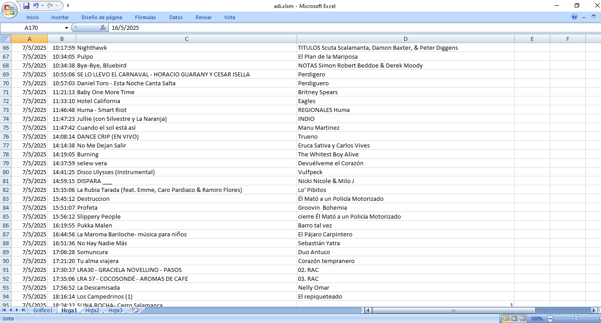

# 🧾 Automatización silenciosa de importación de datos en Excel

Este proyecto permite automatizar la ejecución de una macro en un archivo Excel (.xlsm) mediante un script `.vbs` que se ejecuta en segundo plano desde el Programador de tareas de Windows. Su objetivo es evitar cualquier tipo de interrupción al operador durante la ejecución, haciendo el proceso 100% invisible.

---

## ⚙️ ¿Qué hace?

- Abre un archivo Excel con macros de forma oculta (sin mostrar la interfaz)
- Ejecuta automáticamente una macro que importa datos
- Cierra el archivo sin guardar (el guardado lo realiza la macro internamente)
- Se ejecuta desde una **tarea programada de Windows** sin generar alertas ni interrupciones

---

## 📁 Archivos principales

| Archivo                  | Descripción |
|--------------------------|-------------|
| `auto_import.vbs`        | Script que ejecuta Excel de forma oculta y llama a la macro |
| `ImportarCancionesZaraRadio.bas` | Código fuente de la macro en VBA exportado desde Excel |
| `tareas_programadas.md`  | Guía paso a paso para configurar la tarea automática en Windows |
| `captura_1.png`          | Imagen ilustrativa de la planilla de excel generada |

---

## 🖼️ Captura de pantalla

---

## 🧠 Motivación

Este desarrollo nació de una necesidad real en un entorno de radio AM, donde el operador no debía ser interrumpido mientras se automatizaban tareas administrativas (importación de canciones reproducidas). El proyecto fue adaptado para integrarse sin fricciones al flujo de trabajo diario.

---

## 💼 Aplicación en un portfolio

Aunque fue hecho para un caso específico, representa conocimientos transferibles como:

- Automatización de flujos de trabajo con Windows
- Integración entre lenguajes (VBS + VBA + Excel)
- Diseño de soluciones sin supervis

